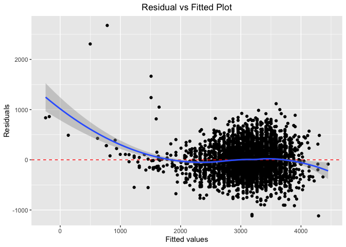
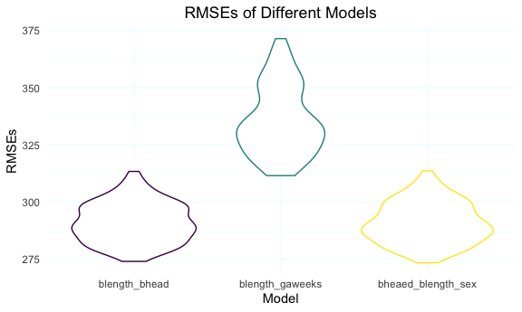

p8105_hw6_wb2366
================

``` r
library(tidyverse)
library(readr)
library(corrplot)
library(modelr)
library(mgcv)
```

## Problem1

**Load the dataset, clean and check for missing data**

``` r
birthweight_df <- read_csv("birthweight.csv", show_col_types = F) %>%
  mutate(
    babysex = fct_infreq(as.factor(babysex)),
    frace = fct_infreq(as.factor(frace)),
    malform = fct_infreq(as.factor(malform)),
    mrace = fct_infreq(as.factor(mrace))
  )

apply(is.na(birthweight_df), 2, which) ## make sure that there is no missing value
```

    ## integer(0)

**Propose a regression model for birthweight.(Based on the a data-driven
model-building)**

``` r
birthweight_df %>%
  select(-babysex,-frace,-malform,-mrace,-pnumlbw,-pnumsga) %>%
  cor(method = "pearson") %>%
  corrplot(
    method = "color",
    type = "lower",
    tl.col = "Black",
    tl.srt = 45,
    diag = F,
    order = "AOE"
  )
```

<!-- -->

``` r
fit_bwt_le_he <- lm(bwt ~ blength + bhead, data = birthweight_df) 

fit_bwt_le_he %>%   
  broom::tidy() %>% 
  knitr::kable(digits = 3)
```

| term        |  estimate | std.error | statistic | p.value |
|:------------|----------:|----------:|----------:|--------:|
| (Intercept) | -6029.620 |    95.821 |   -62.926 |       0 |
| blength     |    85.030 |     2.076 |    40.955 |       0 |
| bhead       |   146.021 |     3.489 |    41.851 |       0 |

``` r
birthweight_df %>%
  modelr::add_residuals(fit_bwt_le_he) %>%
  modelr::add_predictions(fit_bwt_le_he) %>%
  ggplot(aes(x = pred, y = resid)) +
  geom_point() +
  geom_hline(yintercept = 0,
             col = "red",
             linetype = "dashed") +
  geom_smooth(method = "loess") +
  labs(title = "Residual vs Fitted Plot",
       x = "Fitted values",
       y = "Residuals") +
  theme(plot.title = element_text(hjust = 0.5))
```

    ## `geom_smooth()` using formula 'y ~ x'

<!-- -->

**Describe the modeling process**

*Step1:* make a multiple Pearson’s correlation coefficient matrix in
which the result is closer to 1 or -1 means that there is a high
correlation between those two variants.

*Step2:* Comparing the results, I notice that `blength`(baby’s length at
birth) and `bhead`(baby’s head circumference at birth) have a potential
correlation with `bwt`(baby’s birth weight)

*Step3:* Build a linear regression model for baby’s birth weight which
may depend on baby’s length and baby’s head circumference at birth.

*Step4:* Here we see that linearity seems to hold reasonably well, as
the blue line is close to the dashed line, especially for scale from
1500 to 4000 where most data falls in.

**Compare your model to two others:**

``` r
set.seed(30)
cv_df <- crossv_mc(birthweight_df, 100) 

cv_df %>%
  mutate(train = map(train, as_tibble),
         test = map(test, as_tibble)) %>%
  mutate(
    mod_blength_bhead = map(train, ~ lm(bwt ~ blength + bhead, data = .x)),
    mod_blength_gaweeks = map(train, ~ lm(bwt ~ blength + gaweeks, data = .x)),
    mod_bheaed_blength_sex = map(
      train,
      ~ lm(bwt ~ babysex + bhead + blength + babysex * bhead + 
          babysex * blength + bhead * blength + 
          babysex * bhead * blength,data = .x))
  ) %>%
  mutate(
    rmse_mod_blength_bhead = map2_dbl(mod_blength_bhead, test, ~ rmse(model = .x, data = .y)),
    rmse_mod_blength_gaweeks = map2_dbl(mod_blength_gaweeks, test, ~ rmse(model = .x, data = .y)),
    rmse_mod_bheaed_blength_sex = map2_dbl(mod_bheaed_blength_sex, test, ~ rmse(model = .x, data = .y))) %>% 
  select(starts_with("rmse")) %>% 
  pivot_longer(
    everything(),
    names_to = "model", 
    values_to = "rmse",
    names_prefix = "rmse_mod_") %>% 
  mutate(model = fct_inorder(model)) %>% 
  ggplot(aes(x = model, y = rmse, color = model)) + 
  geom_violin() + 
  labs(title = "RMSEs of Different Models",
       y = "RMSEs",
       x = "Model") +
  theme(plot.title = element_text(hjust = 0.5),
        legend.position = "none",
        panel.background = element_blank(),
        panel.grid = element_line(color = "azure1"))
```

<!-- -->

**Conclusion:** Comparing the violin plot, we could figure out that for
model 1 and 3 is more accurate while the RMSEs are much bigger in model
2 which means that the error rate of this linear regression model seems
be high.

## Problem2

**Load the dataset.**

``` r
weather_df = 
  rnoaa::meteo_pull_monitors(
    c("USW00094728"),
    var = c("PRCP", "TMIN", "TMAX"), 
    date_min = "2017-01-01",
    date_max = "2017-12-31") %>%
  mutate(
    name = recode(id, USW00094728 = "CentralPark_NY"),
    tmin = tmin / 10,
    tmax = tmax / 10) %>%
  select(name, id, everything())
```

    ## Registered S3 method overwritten by 'hoardr':
    ##   method           from
    ##   print.cache_info httr

    ## file min/max dates: 1869-01-01 / 2021-11-30
