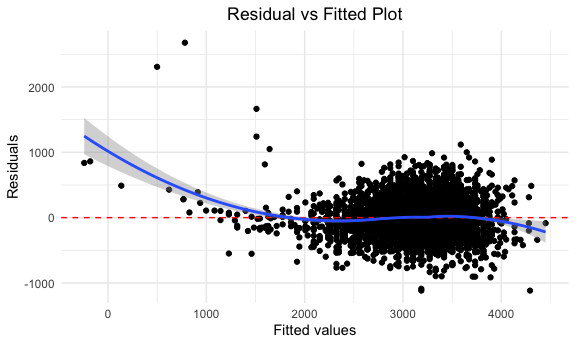

p8105_hw6_wb2366
================

``` r
library(tidyverse)
```

    ## ── Attaching packages ─────────────────────────────────────── tidyverse 1.3.1 ──

    ## ✓ ggplot2 3.3.5     ✓ purrr   0.3.4
    ## ✓ tibble  3.1.4     ✓ dplyr   1.0.7
    ## ✓ tidyr   1.1.3     ✓ stringr 1.4.0
    ## ✓ readr   2.0.1     ✓ forcats 0.5.1

    ## ── Conflicts ────────────────────────────────────────── tidyverse_conflicts() ──
    ## x dplyr::filter() masks stats::filter()
    ## x dplyr::lag()    masks stats::lag()

``` r
library(readr)
library(corrplot)
```

    ## corrplot 0.92 loaded

``` r
library(modelr)
```

## Problem1

**Load the dataset, clean and check for missing data**

``` r
birthweight_df <- read_csv("birthweight.csv") %>%
  mutate(
    babysex = fct_infreq(as.factor(babysex)),
    frace = fct_infreq(as.factor(frace)),
    malform = fct_infreq(as.factor(malform)),
    mrace = fct_infreq(as.factor(mrace))
  )
```

    ## Rows: 4342 Columns: 20

    ## ── Column specification ────────────────────────────────────────────────────────
    ## Delimiter: ","
    ## dbl (20): babysex, bhead, blength, bwt, delwt, fincome, frace, gaweeks, malf...

    ## 
    ## ℹ Use `spec()` to retrieve the full column specification for this data.
    ## ℹ Specify the column types or set `show_col_types = FALSE` to quiet this message.

``` r
apply(is.na(birthweight_df), 2, which) ## make sure that there is no missing value
```

    ## integer(0)

**Propose a regression model for birthweight.(Based on the a data-driven
model-building)**

``` r
birthweight_df %>%
  select(-babysex,-frace,-malform,-mrace,-pnumlbw,-pnumsga) %>%
  cor(method = "pearson") %>%
  corrplot(
    method = "color",
    type = "lower",
    tl.col = "Black",
    tl.srt = 45,
    diag = F,
    order = "AOE"
  )
```

<!-- -->

``` r
fit_bwt_le_he <- lm(bwt ~ blength + bhead, data = birthweight_df) 

fit_bwt_le_he %>%   
  broom::tidy() %>% 
  knitr::kable(digits = 3)
```

| term        |  estimate | std.error | statistic | p.value |
|:------------|----------:|----------:|----------:|--------:|
| (Intercept) | -6029.620 |    95.821 |   -62.926 |       0 |
| blength     |    85.030 |     2.076 |    40.955 |       0 |
| bhead       |   146.021 |     3.489 |    41.851 |       0 |

``` r
birthweight_df %>%
  modelr::add_residuals(fit_bwt_le_he) %>%
  modelr::add_predictions(fit_bwt_le_he) %>%
  ggplot(aes(x = pred, y = resid)) +
  geom_point() +
  geom_hline(yintercept = 0,
             col = "red",
             linetype = "dashed") +
  geom_smooth(method = "loess") +
  labs(title = "Residual vs Fitted Plot",
       x = "Fitted values",
       y = "Residuals") +
  theme(plot.title = element_text(hjust = 0.5))
```

    ## `geom_smooth()` using formula 'y ~ x'

<!-- -->

**Describe the modeling process**

**Step1:**make a multiple Pearson’s correlation coefficient matrix in
which the result is closer to 1 or -1 means that there is a high
correlation between those two variants.

**Step2:**Comparing the results, I notice that `blength`(baby’s length
at birth) and `bhead`(baby’s head circumference at birth) have a
potential correlation with `bwt`

**Step3:**Build a linear regression model for baby’s birth weight which
may depend on baby’s length and baby’s head circumference at birth.

**Step4:**Here we see that linearity seems to hold reasonably well, as
the blue line is close to the dashed line, especially for scale from
1500 to 4000 where most data falls in.
